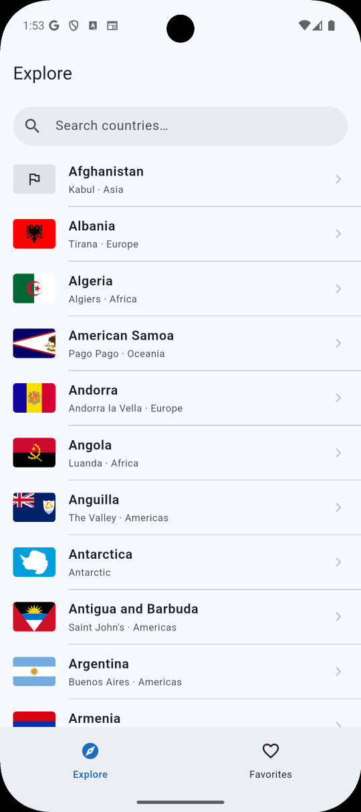
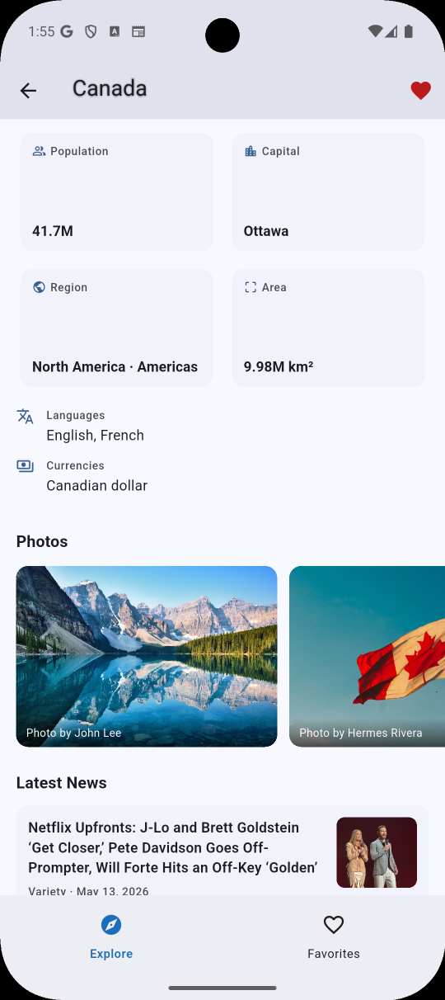
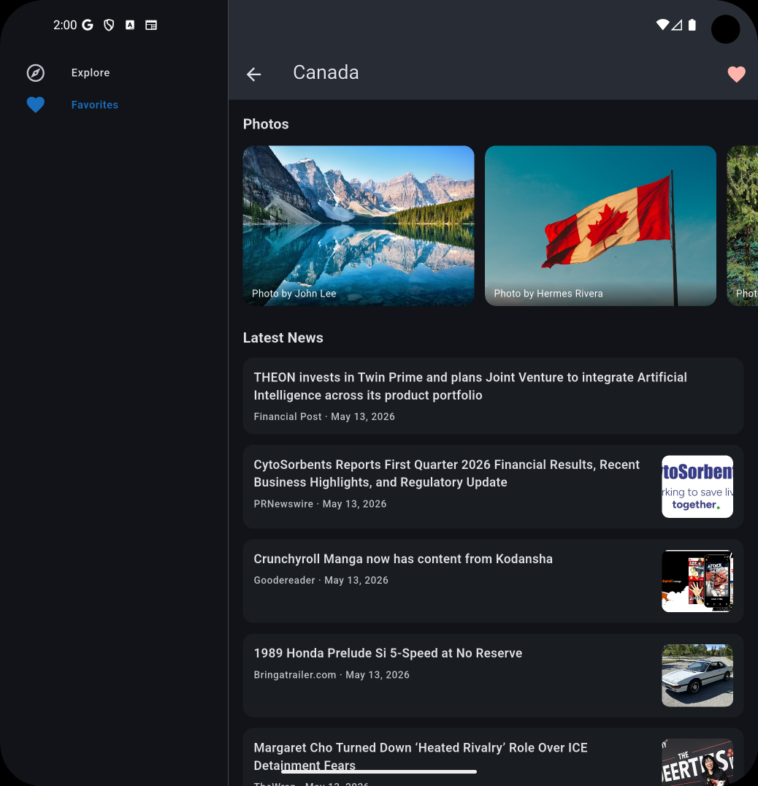

# Global Explorer

Explore every country on Earth, geographic facts, Unsplash photos, and live news — with offline-ready favorites.

| Explore | Country Detail | News |
|---|---|---|
|  |  |  |

---

## Setup

### Prerequisites
- Flutter 3.41.x / Dart 3.11.x
- [Unsplash](https://unsplash.com/developers) Access Key
- [NewsAPI](https://newsapi.org) API Key

### API keys

Create a `.env` file in the project root with your keys:

```
UNSPLASH_ACCESS_KEY=your_unsplash_access_key
NEWS_API_KEY=your_news_api_key
```

> The REST Countries API needs no key. Keys are loaded at startup via `flutter_dotenv` — the app will not crash without them, but images and news sections will be empty.

### Run
```bash
flutter pub get
dart run build_runner build   # generates Drift + json_serializable code
flutter run
```

### Test
```bash
flutter test   
flutter analyze 
```

---

## Architecture

Three feature slices (`countries`, `country_detail`, `favorites`) each following the same layered split:

```
data/        DTOs → datasources → repository impls
domain/      entities + repository interfaces
presentation/ cubits + screens + widgets
```

Shared infrastructure lives in `core/` (DI via GetIt, GoRouter, Dio clients, errors, theme).

**State** : `flutter_bloc` with Dart 3 `sealed class` states. Exhaustive `switch` in every builder, no `is` checks.

**Navigation** : `go_router` `StatefulShellRoute.indexedStack`. Branch-disambiguated Hero tags (`flag-explore-*` / `flag-favorites-*`) prevent animation conflicts. Country objects travel via `extra` — no extra API call on push.

**Persistence** : Drift SQLite with `NativeDatabase.createInBackground` (no jank), `insertOnConflictUpdate` (idempotent heart-taps), and two reactive streams driving the cubit and the heart icon independently.

**Networking** : Three Dio clients (one per base URL). `DioException.toAppException()` extension centralises error conversion. REST Countries uses `?fields=` to cut the payload from ~800 KB to ~80 KB. Detail screen fetches photos and news with `Future.wait(eagerError: false)` — partial failure is intentional.

---

## Trade-offs

**No `freezed`** : conflicts with `bloc_test`'s analyzer version. Dart 3 `sealed class` gives the same exhaustive-switch guarantee with zero codegen for state files.

**No `dartz`** : a 27-line hand-rolled `Either<L, R>` covers all usage. A full FP package for one abstraction would be over-engineering.

**No thin use-case wrappers** : pure pass-throughs were removed; only `SearchCountries` (real filtering logic, timing-tested with `fake_async`) was kept.

**In-memory search** : all 250 countries are loaded once and filtered with a 300 ms debounce. Faster than a network call on every keystroke, and works offline.

**`FavoritesCubit` at app root** : keeps the Drift stream alive across tab switches so the Favorites tab updates instantly when the heart is tapped in Detail.

**Adaptive navigation without a package** : `LayoutBuilder` breakpoints inside `ScaffoldWithNavBar` produce three tiers (NavigationBar / NavigationRail / extended rail) in ~60 lines with no extra dependency.
